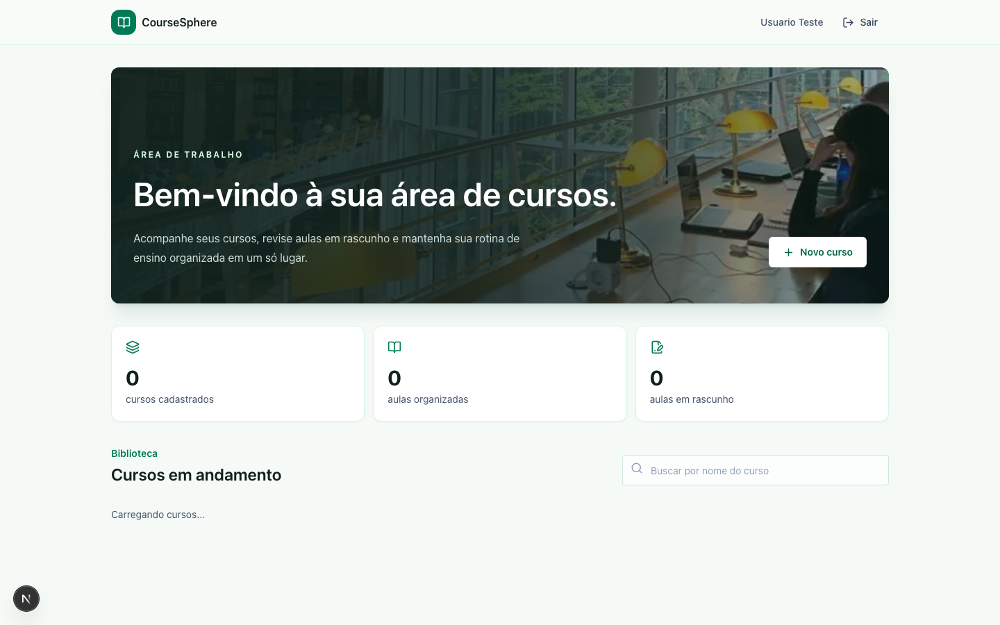
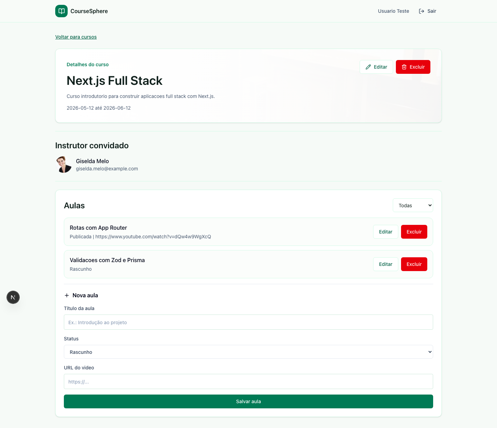

<div align="center">

# CourseSphere

Plataforma full stack para organizar cursos online e aulas

[](https://nextjs.org)
[](https://react.dev)
[](https://www.typescriptlang.org)
[](https://www.prisma.io)
[](https://tailwindcss.com)

</div>

CourseSphere é uma aplicação para organizar cursos online, aulas e rascunhos em um só lugar. A proposta é simples: dar ao instrutor uma área limpa para criar cursos, acompanhar o que já foi publicado e manter o conteúdo com alguma ordem antes de colocar tudo no ar.

Deploy: https://coursesphere-fullstack.vercel.app

## Telas







## O que o projeto faz

- cadastro e login de usuário;
- sessão com cookie HTTP-only;
- criação, busca, edição e exclusão de cursos;
- criação, edição e exclusão de aulas;
- filtro de aulas por rascunho ou publicada;
- proteção para cada usuário ver e editar apenas os próprios cursos;
- sugestão de instrutor convidado usando uma API externa.

## Rodando localmente

Instale as dependências:

```bash
npm install
```

Crie o `.env`:

```bash
cp .env.example .env
```

Prepare o banco:

```bash
npm run prisma:generate
npm run db:setup
```

Suba o projeto:

```bash
npm run dev
```

Depois acesse:

```txt
http://localhost:3000
```

Usuário criado pelo seed:

```txt
teste@coursesphere.com
123456
```

## Comandos úteis

```bash
npm run dev
npm run build
npm run lint
npm run test:e2e
npm run db:setup
```

## Stack

Next.js, React, TypeScript, Tailwind CSS, Prisma, SQLite, TanStack Query, Zustand, Zod, React Hook Form e Playwright.

## Observação

O projeto usa SQLite para facilitar a demonstração. Em produção, os dados podem voltar ao estado inicial caso o ambiente seja recriado.

## Autor

<div align="center">

Geozedeque Guimarães — Estudante de Ciência da Computação, CIn-UFPE

[](https://github.com/GeozedequeGuimaraes)
[](https://linkedin.com/in/geozedeque-guimaraes)

</div>
